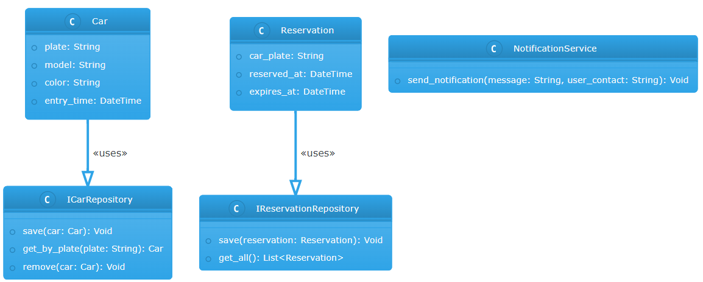

# Sistema de Monitoramento de Estacionamento com IA

O Sistema de Monitoramento de Estacionamento com IA é uma solução inovadora que utiliza Inteligência Artificial para otimizar a gestão de vagas de estacionamento. Ele permite o registro de carros, a reserva de vagas, envio de notificações e prevê a disponibilidade de vagas.

# Arquitetura do Sistema
O sistema segue a arquitetura de camadas e DDD (Domain-Driven Design), com código limpo e organizado em diferentes diretórios, representando as camadas de Domínio, Aplicação, Infraestrutura e Interface Web.

# Funcionalidades
1. Registro de Carros
Permite o registro de carros no sistema, armazenando informações como placa, modelo, cor e horário de entrada.

2. Sistema de Reservas
Os usuários podem reservar vagas de estacionamento com antecedência, evitando o risco de não encontrar vagas disponíveis.

3. Sistema de Notificações
Envia notificações para os usuários quando uma vaga estiver disponível ou quando a reserva estiver prestes a expirar.

4. Inteligência Artificial
Utiliza modelos de IA para otimizar a alocação de vagas e prever a disponibilidade de vagas em diferentes horários e dias.
